# 生产数据分析系统详细设计说明

> 目标：让第一次接触该系统的人，也能快速理解“怎么用、怎么改、怎么排错”。文档覆盖架构、模块、函数、算法、接口与运行全链路。

---

## 1. 系统目标与能力范围

系统面向生产数据的全流程闭环：

1. 用户注册/登录
2. 生产数据采集
3. 生产记录分页查询与编辑
4. 统计汇总
5. 趋势可视化数据输出
6. 日报生成与CSV导出

核心特性：

- 用户数据隔离（每条记录绑定 user_id）
- 会话Token机制
- 面向 API + 简易 UI 双通道

---

## 2. 架构总览

### 2.1 分层架构图

```mermaid
flowchart TB
    C1[浏览器前端] --> API[FastAPI Router(main.py)]
    C2[外部系统/API客户端] --> API

    API --> AUTH[get_current_user鉴权]
    API --> VAL[参数校验 validate_date_range + Pydantic]
    API --> CRUD[crud.py 业务数据访问]

    CRUD --> ORM[models.py ORM实体]
    ORM --> DB[(SQLite)]

    API --> SCH[schemas.py 响应模型]
    API --> DEP[database.py get_db依赖]
    DEP --> DB
```

### 2.2 启动结构图

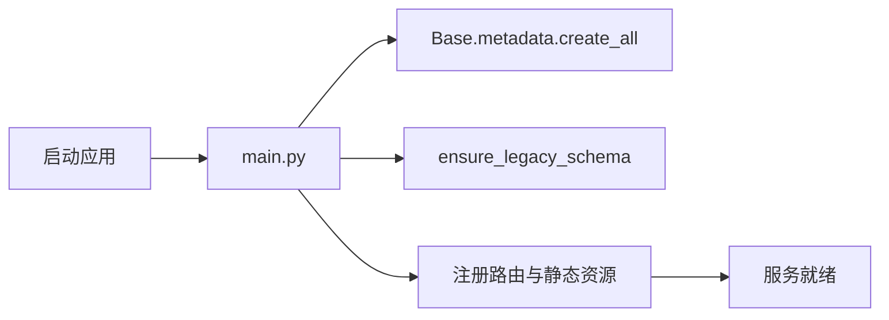

---

## 3. 软件结构图（目录级）

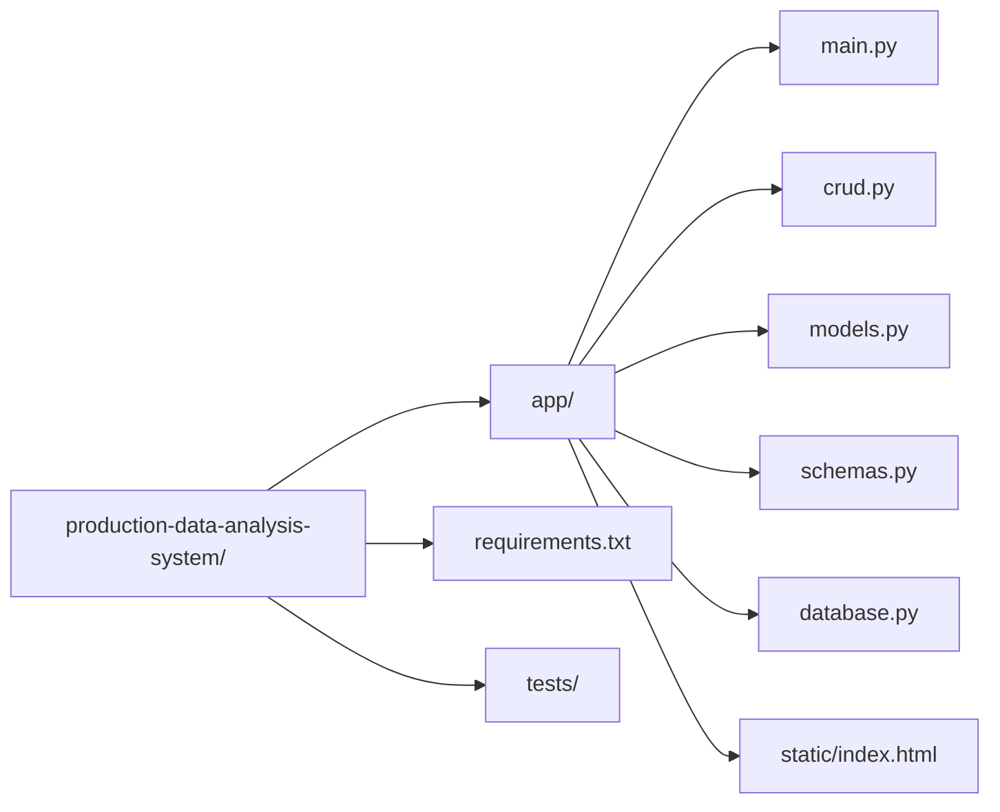

---

## 4. 数据模型设计

### 4.1 主要实体

- `User`：用户账号
- `UserSession`：登录Token与过期时间
- `ProductionRecord`：生产记录

### 4.2 ER 图

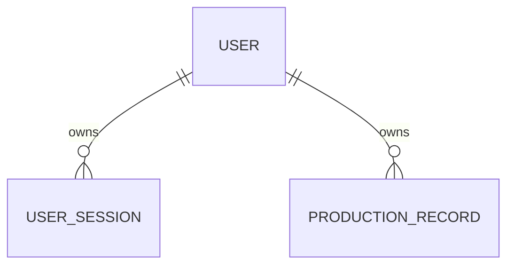

### 4.3 记录关键字段（概念）

- 产线名 `line_name`
- 产品名 `product_name`
- 生产日期 `production_date`
- 产量 `output_quantity`
- 不良数 `defect_quantity`
- 单件成本 `unit_cost`

---

## 5. 业务流程图

### 5.1 注册与登录流程

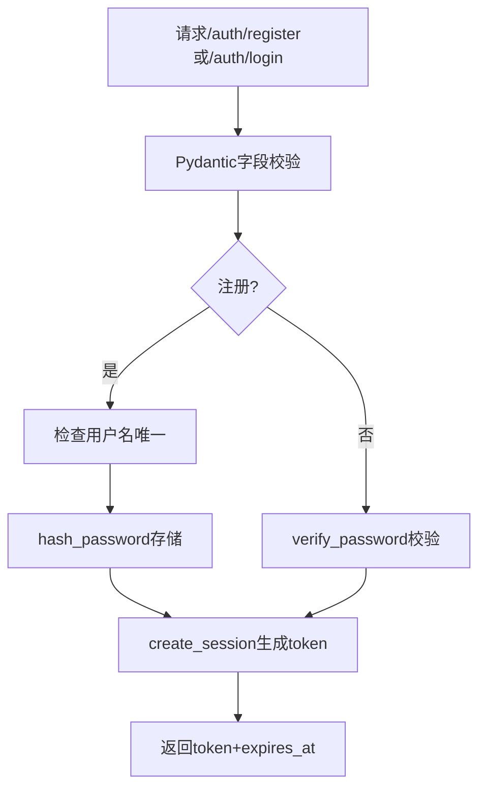

### 5.2 采集数据流程

```mermaid
flowchart TD
    A[POST /production-data] --> B[Bearer鉴权]
    B --> C[Schema校验]
    C --> D[crud.create_record(user_id)]
    D --> E[写入DB]
    E --> F[返回记录详情]
```

### 5.3 分页查询流程

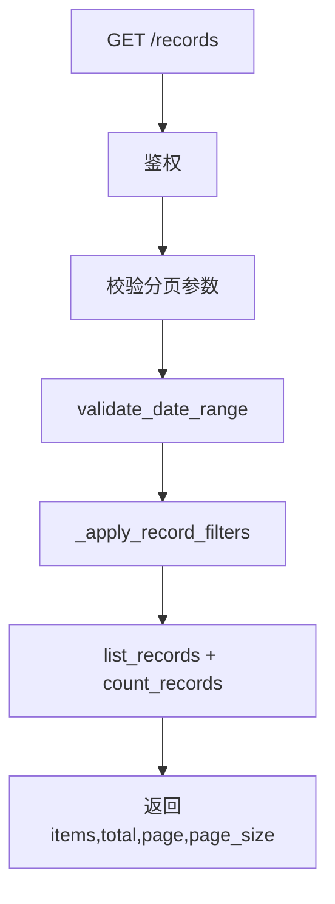

### 5.4 统计分析流程

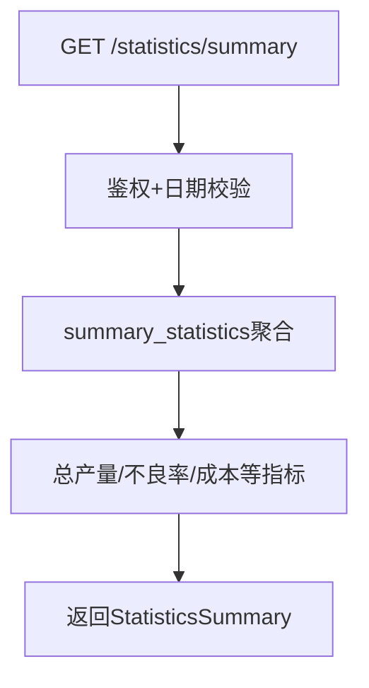

### 5.5 可视化趋势流程

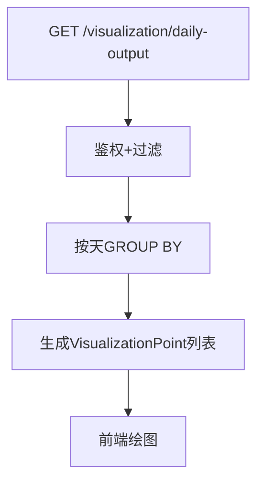

### 5.6 报表导出流程

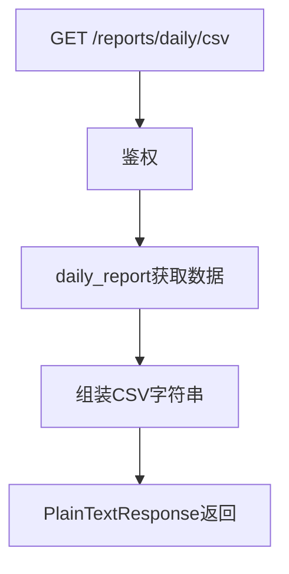

---

## 6. 模块职责（非常具体）

| 模块 | 责任边界 | 不负责内容 |
|---|---|---|
| `main.py` | 路由定义、依赖注入、鉴权接入、HTTP响应组装 | 复杂SQL细节 |
| `crud.py` | 数据增删改查、统计聚合、密码会话算法 | HTTP层协议处理 |
| `models.py` | ORM实体定义、表结构映射 | 参数合法性校验 |
| `schemas.py` | 请求/响应字段约束、类型声明 | 数据库读写 |
| `database.py` | Engine/Session创建、`get_db`生命周期 | 业务逻辑 |

---

## 7. 函数设计（函数名 + 输入输出 + 作用）

### 7.1 `main.py`

- `ensure_legacy_schema()`
  - 作用：老库兼容迁移（补 `user_id`、`expires_at`）。
  - 输入：无。
  - 输出：无（就地修复库结构）。
- `validate_date_range(start_date, end_date)`
  - 作用：防止起始晚于结束。
  - 失败：抛 HTTP 400。
- `get_current_user(credentials, db)`
  - 作用：从 Bearer token 解析当前用户。
  - 失败：401。
- `get_records(...)`
  - 作用：分页查询 + 条件过滤 + 总数统计。
- `export_daily_report_csv(...)`
  - 作用：将日报结果序列化为CSV文本。

### 7.2 `crud.py`

- `hash_password(raw_password, salt=None)`：PBKDF2-SHA256 哈希。
- `verify_password(raw_password, password_hash)`：校验并兼容历史口令。
- `create_user(db, payload)`：创建用户。
- `create_session(db, user_id)`：创建会话 token。
- `cleanup_expired_sessions(db)`：清理过期会话。
- `get_user_by_token(db, token)`：token反查用户。
- `_apply_record_filters(...)`：统一拼接查询条件。
- `summary_statistics(...)`：统计聚合输出。
- `visualization_by_day(...)`：按日趋势点输出。
- `daily_report(...)`：日报聚合行输出。

---

## 8. 接口设计

### 8.1 鉴权接口

- `POST /auth/register`
- `POST /auth/login`
- `POST /auth/logout`
- `GET /auth/me`

### 8.2 业务接口

- `POST /production-data`
- `GET /records`
- `GET /records/{record_id}`
- `PUT /records/{record_id}`
- `DELETE /records/{record_id}`

### 8.3 分析接口

- `GET /statistics/summary`
- `GET /visualization/daily-output`
- `GET /reports/daily`
- `GET /reports/daily/csv`

### 8.4 前端与文档

- `GET /`：首页UI
- `GET /docs`：Swagger 文档
- `GET /health`：健康检查

---

## 9. 算法设计

### 9.1 密码安全算法

- 采用 `PBKDF2-SHA256`（带盐，多轮迭代）存储。
- 登录验证时兼容历史 SHA256，可逐步升级历史账号。

### 9.2 会话算法

1. 登录生成随机 token。
2. token 与 `expires_at` 关联到 `user_sessions`。
3. 每次鉴权前清理过期会话，确保失效及时。

### 9.3 条件过滤算法

- `_apply_record_filters` 对同一查询对象连续追加过滤：
  - 用户维度（强制）
  - 产线
  - 产品
  - 日期区间

### 9.4 聚合统计算法

- 汇总：`SUM(output_quantity)`、`SUM(defect_quantity)`、均值/总成本等。
- 趋势：按 `production_date` 分组输出序列点。
- 报表：按目标日汇总并规范字段顺序。

---

## 10. 运行设计

### 10.1 启动与停止

- 启动：`uvicorn app.main:app --reload`
- 停止：Ctrl+C 或进程管理器停止。

### 10.2 请求生命周期

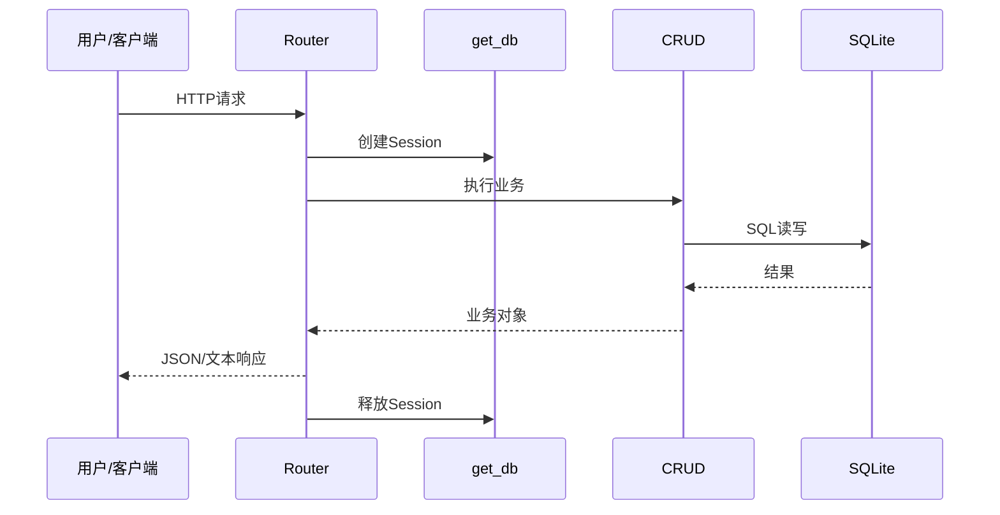

### 10.3 并发与资源管理

- 每请求独立 DB session，避免跨请求污染。
- SQLite 适合中低并发；高并发建议切 PostgreSQL。

### 10.4 可运维设计

- `/health` 可被监控探针调用。
- `/docs` 提供在线接口契约。
- 建议接入日志采集与慢查询分析。

---

## 11. 安全设计

- Bearer Token 保护业务接口。
- 用户隔离基于 `user_id` 强约束。
- 统一错误避免暴露内部实现。
- 建议生产环境启用 HTTPS 与强随机 `SECRET_KEY`。

---

## 12. 扩展与演进建议

1. 数据库升级 PostgreSQL。
2. 引入角色权限（管理员/分析员/操作员）。
3. 报表任务定时化（日报、周报自动推送）。
4. 增加异常检测算法（产量突变告警）。

---

## 13. 快速排障清单

1. 登录失败：检查 token 是否过期、用户是否存在。
2. 查询为空：确认筛选条件过严、用户隔离是否正确。
3. CSV乱码：确认客户端按 UTF-8 打开。
4. 统计异常：核对生产日期与成本字段类型。


---

## 14. 模块之间的联系（重点细化）

### 14.1 路由层与CRUD层关系图

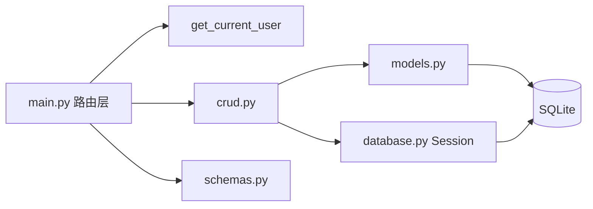

### 14.2 联系说明（按调用链）

1. `main.py` 不直接写复杂 SQL：
   - 只做“鉴权 + 参数校验 + 编排响应”。
   - 真实数据处理下沉到 `crud.py`。
2. `crud.py` 不感知 HTTP：
   - 不返回 HTTP 状态码，只返回业务对象/结果。
   - 这样可被接口层和测试层复用。
3. `schemas.py` 在路由层与业务层之间充当“契约”：
   - 请求校验防止脏数据进入 `crud.py`。
   - 响应模型保证字段稳定。
4. `database.py` 通过 `get_db` 管理 Session 生命周期：
   - 路由调用结束后自动释放，避免连接泄露。

### 14.3 典型时序：查询列表并统计

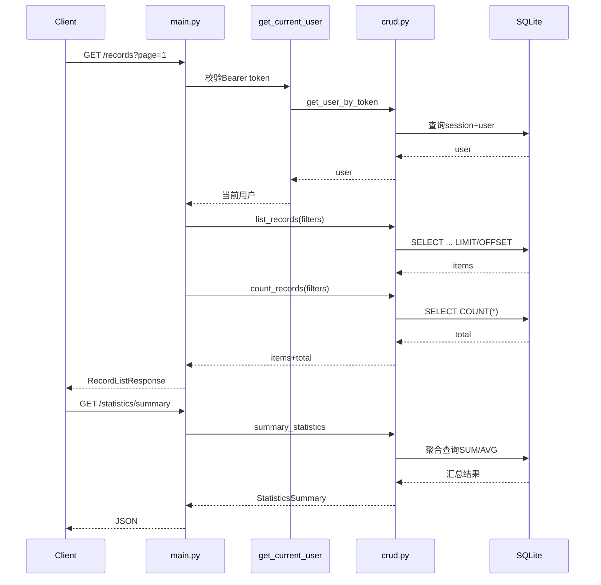

### 14.4 模块协作约束

| 约束 | 执行模块 | 影响模块 |
|---|---|---|
| token 必须有效 | `main.py` + `crud.get_user_by_token` | 所有业务接口 |
| 用户隔离必须生效 | `crud._apply_record_filters` | 列表/统计/报表 |
| 日期范围必须合法 | `main.validate_date_range` | 查询与统计接口 |
| 响应结构必须稳定 | `schemas.py` + FastAPI response_model | 前端与第三方调用方 |
| 会话过期需清理 | `crud.cleanup_expired_sessions` | 鉴权链路 |


---

## 15. 进一步细化：契约、容量与运维

### 15.1 接口字段级校验清单（核心）

| 接口 | 字段 | 校验 | 失败行为 |
|---|---|---|---|
| `POST /auth/register` | `username` | 最小长度、唯一性 | 400 |
| `POST /auth/login` | `username/password` | 凭证匹配 | 401 |
| `POST /production-data` | 业务字段 | Pydantic类型+范围 | 422/400 |
| `GET /records` | `page/page_size` | `page>=1`,`1<=size<=200` | 422 |
| `GET /statistics/summary` | `start/end_date` | start<=end | 400 |

### 15.2 数据口径定义（避免统计歧义）

- **总产量**：过滤后 `output_quantity` 求和。
- **总不良数**：过滤后 `defect_quantity` 求和。
- **平均单件成本**：过滤后 `unit_cost` 的算术平均。
- **总成本**：`Σ(output_quantity * unit_cost)`（若按实现不同，应在代码中保持唯一口径）。

### 15.3 容量与索引建议

- 数据量 < 100万行：SQLite 可用，但建议加复合索引：`(user_id, production_date)`。
- 数据量持续增长或并发写高：迁移 PostgreSQL。
- 大查询建议分页上限控制与导出异步化。

### 15.4 鉴权链路故障定位

1. 401 先看 `Authorization` 头是否缺失。
2. token 存在但失败：检查 `user_sessions.expires_at`。
3. 会话存在但无用户：检查用户被删除/数据不一致。
4. 高频401：核对客户端是否缓存旧 token。

### 15.5 备份与发布回滚建议

- 发布前：备份 SQLite 文件 + 记录当前 commit。
- 发布后：执行 `/health`、登录、查询、统计、导出冒烟。
- 回滚：恢复 DB 备份并回退到上一个稳定 commit。


---

## 16. 深度细化：统计口径样例、性能压测、应急手册

### 16.1 统计口径样例（带输入输出）

输入记录（示例）：

| 日期 | 产线 | 产品 | 产量 | 不良 | 单件成本 |
|---|---|---|---:|---:|---:|
| 2026-01-01 | L1 | P1 | 100 | 3 | 2.0 |
| 2026-01-01 | L1 | P2 | 80 | 2 | 2.5 |

输出（摘要示例）：

- 总产量：180
- 总不良：5
- 平均单件成本：2.25
- 总成本：100*2.0 + 80*2.5 = 400

> 说明：若代码总成本口径不同（如净合格品成本），必须在文档与实现保持一致并在版本日志声明。

### 16.2 推荐压测场景

| 场景 | 并发 | 持续时间 | 目标 |
|---|---:|---:|---|
| 登录接口 | 20 | 5min | p95 < 300ms |
| 列表查询 | 30 | 10min | p95 < 500ms |
| 统计接口 | 10 | 5min | p95 < 700ms |
| CSV导出 | 5 | 5min | 无5xx且结果完整 |

### 16.3 性能瓶颈定位顺序

1. 先看慢查询（是否缺 `user_id+date` 索引）。
2. 再看分页参数是否过大（`page_size` 逼近上限）。
3. 再看统计是否扫描全表（过滤条件缺失）。
4. 最后看存储层性能（磁盘IO、锁竞争）。

### 16.4 应急处置SOP（401激增/统计超时）

#### 16.4.1 401 激增

- 排查 token 过期策略是否被错误缩短。
- 排查客户端是否未刷新 token。
- 排查会话清理任务是否误删有效会话。

#### 16.4.2 统计超时

- 临时缩小日期范围，确认是数据量问题还是SQL问题。
- 增加必要索引并复测。
- 必要时降级：仅返回核心统计项，趋势图异步计算。

### 16.5 上线后巡检表

- [ ] `/health` 连续 24h 正常。
- [ ] `/auth/login` 成功率 > 99.9%。
- [ ] `/records` p95 在目标阈值内。
- [ ] `/statistics/summary` 超时率 < 0.1%。
- [ ] 导出 CSV 随机抽样校验通过。


---

## 17. 深化补充：SLO、容量规划与数据质量策略

### 17.1 服务级目标（SLO）建议

| 指标 | 目标 |
|---|---|
| `/auth/login` 成功率 | >= 99.9% |
| `/records` p95 | <= 500ms |
| `/statistics/summary` p95 | <= 700ms |
| `/reports/daily/csv` 失败率 | < 0.1% |

### 17.2 容量规划简表

| 维度 | 低规模 | 中规模 | 建议 |
|---|---|---|---|
| 日增记录 | < 1万 | 1万-10万 | 中规模以上建议迁移PG |
| 查询并发 | < 20 | 20-100 | 引入缓存与异步任务 |
| 报表导出 | 偶发 | 高频 | 采用离线生成 |

### 17.3 数据质量校验规则

1. `output_quantity >= 0`
2. `defect_quantity >= 0`
3. `defect_quantity <= output_quantity`
4. `unit_cost >= 0`
5. `production_date` 不得晚于当前业务日（按业务约束可放宽）

### 17.4 质量巡检任务（建议日常化）

- 每日抽样 1% 记录核对业务口径。
- 每日检查会话过期清理是否生效。
- 每周检查慢查询与索引命中率。
- 每周演练一次报表导出与恢复流程。

---

## 18. 函数级说明（贴合当前代码）

### 18.1 `app/database.py`

| 函数 | 作用 | 依赖库 | 关键调用关系 |
|---|---|---|---|
| `get_db` | 提供 SQLAlchemy Session（请求级） | `sqlalchemy.orm` | FastAPI `Depends` 注入后在请求结束释放 |

### 18.2 `app/crud.py`（核心业务函数）

| 函数 | 作用 | 依赖库 | 关键调用关系 |
|---|---|---|---|
| `hash_password` | PBKDF2-SHA256 哈希密码 | `hashlib`、`secrets` | 注册/密码升级使用 |
| `verify_password` | 校验密码（兼容历史 hash） | `hashlib`、`hmac` | 登录鉴权使用 |
| `create_user/get_user_by_username/verify_user` | 用户创建与验证 | `sqlalchemy` | 登录注册主链路 |
| `create_session/cleanup_expired_sessions/get_user_by_token/get_session_by_token/remove_session` | 会话 token 生命周期管理 | `datetime`、`secrets`、`sqlalchemy` | 认证链路 |
| `create_record/get_record/update_record/delete_record` | 记录 CRUD | `sqlalchemy` | `/production-data` 与 `/records/*` |
| `_apply_record_filters` | 拼接用户/产线/产品/日期过滤 | `sqlalchemy` | 被列表、计数、统计复用 |
| `list_records/count_records` | 列表分页与总数统计 | `sqlalchemy` | `/records` |
| `summary_statistics` | 汇总统计 | `sqlalchemy.func` | `/statistics/summary` |
| `visualization_by_day` | 按日聚合趋势点 | `sqlalchemy.func` | `/visualization/daily-output` |
| `daily_report` | 生成日报行数据 | `sqlalchemy` | `/reports/daily` 与 CSV 导出 |

### 18.3 `app/main.py`（路由编排函数）

| 函数 | 作用 | 依赖库 | 关键调用关系 |
|---|---|---|---|
| `ensure_legacy_schema` | 兼容旧库字段（迁移补列） | `sqlalchemy.inspect/text` | 应用启动时执行 |
| `index_page` | 返回静态首页 | `fastapi.responses.FileResponse` | `/` |
| `health_check` | 健康检查 | FastAPI | `/health` |
| `validate_date_range` | 校验开始/结束日期 | FastAPI `HTTPException` | 查询统计统一前置校验 |
| `get_current_user` | Bearer token 取当前用户 | `fastapi.security`、`crud.get_user_by_token` | 受保护接口依赖 |
| `register/login/logout/current_user` | 认证相关路由 | FastAPI + CRUD | `/auth/*` |
| `create_production_data` | 采集数据入口 | `crud.create_record` | `POST /production-data` |
| `get_records/get_record/update_record/delete_record` | 记录管理入口 | CRUD 列表与详情函数 | `/records*` |
| `get_summary/get_visualization_data` | 统计和趋势入口 | `crud.summary_statistics/visualization_by_day` | `/statistics/*` `/visualization/*` |
| `get_daily_report/export_daily_report_csv` | 日报与CSV导出入口 | `crud.daily_report`、`PlainTextResponse` | `/reports/daily*` |


---

## 19. 安全要点逐条深度解释（与你提出的小点一一对应）

### 19.1 “Bearer Token 保护业务接口”——为什么、怎么做、怎么验

**是什么**：
- 业务接口（如 `/production-data`、`/records`、`/statistics/*`）要求请求头携带 `Authorization: Bearer <token>`。  

**为什么**：
1. 把“身份声明”从业务参数中剥离，避免通过篡改 `user_id` 越权。  
2. 统一鉴权入口，减少遗漏。  

**在本系统怎么实现**：
- 路由通过 `Depends(get_current_user)` 统一获取当前用户。  
- `get_current_user` 内部调用 `crud.get_user_by_token` 校验 token 有效性。  

**如何验证落地是否正确**：
- 无 token 请求应返回 401。  
- 伪造/过期 token 请求应返回 401。  
- 有效 token 才能访问业务数据。  

### 19.2 “用户隔离基于 user_id 强约束”——不是展示层规则，而是数据层规则

**关键原则**：
- 隔离必须发生在查询条件中，而不是只在前端“过滤一下”。  

**本系统落地点**：
- `crud._apply_record_filters` 把 `user_id` 作为所有查询的硬条件之一。  
- 读取单条记录时也按 `record_id + user_id` 联合过滤。  

**错误示例**（应避免）：
- 先按 `record_id` 查询，再比较前端传入 user_id。  

**正确示例思路**：
- SQL/ORM 语句里直接包含 `WHERE record.id=:id AND record.user_id=:uid`。  

### 19.3 “统一错误避免暴露内部实现”——安全与契约稳定双收益

**为什么**：
1. 防信息泄露：避免把表名、路径、堆栈暴露给外部。  
2. 防耦合：前端不依赖后端内部异常字符串。  

**本系统建议做法**：
- 鉴权失败统一 401 + 通用消息。  
- 参数错误统一 400/422 + 清晰字段提示。  
- 服务器异常统一 500 通用响应，细节写日志。  

**日志与对外响应分离**：
- 对外：简短可理解。  
- 对内：包含 `trace_id`、token摘要、SQL上下文（脱敏）。  

### 19.4 “生产启用 HTTPS 与强随机 SECRET_KEY”——必须组合使用

**HTTPS 的作用**：
- 保护传输层，防抓包窃听 token。  

**强随机密钥的作用**：
- 保护签名/加密相关机制，防止伪造。  

**为什么要组合**：
- 只有强密钥但无 HTTPS：token 可能在链路被窃取。  
- 只有 HTTPS 但弱密钥：仍存在会话伪造风险。  

**落地清单**：
- [ ] 仅通过 HTTPS 暴露服务。  
- [ ] 密钥来自环境变量，不入库不入仓。  
- [ ] 密钥定期轮换并有应急替换预案。  
- [ ] 线上日志脱敏，不打印完整 token。  


---

## 20. 算法实现细节（与 `crud.py` / `main.py` 精确对应）

### 20.1 密码算法（`hash_password` / `verify_password`）

**实现目标**：
- 注册时安全存储密码；登录时兼容新旧摘要格式。

**实现过程**：
1. `hash_password`：
   - 生成随机盐（`secrets`）；
   - 使用 `hashlib.pbkdf2_hmac`（PBKDF2-SHA256）迭代计算；
   - 将算法标识、盐、摘要编码后存储。
2. `verify_password`：
   - 解析存储串格式；
   - 若是 PBKDF2 格式，按相同参数重算并比较；
   - 若是历史 SHA256 格式，走兼容分支；
   - 比较使用恒时比较（`hmac.compare_digest`）思路。

### 20.2 会话算法（`create_session` / `cleanup_expired_sessions` / `get_user_by_token`）

**目标**：令牌认证 + 过期失效。  
**步骤**：
1. 登录成功后 `create_session` 生成高熵 token 并写 `expires_at`。
2. 鉴权前可调用 `cleanup_expired_sessions` 清理过期 token。
3. `get_user_by_token` 通过 token 联表/关联找到用户；过期或不存在返回空。

**安全点**：
- token 随机性必须足够；
- 过期时间必须强制检查。

### 20.3 过滤算法（`_apply_record_filters`）

**目标**：把所有列表、统计、报表查询统一到一套过滤逻辑。  
**输入**：`user_id`、`line_name`、`product_name`、`start_date`、`end_date`。  
**输出**：附加完过滤条件的 SQLAlchemy 查询对象。

**实现步骤**：
1. 先加硬约束 `record.user_id == user_id`。
2. 有产线条件则加 `line_name == ?`。
3. 有产品条件则加 `product_name == ?`。
4. 有日期范围则加 `>= start_date` 与 `<= end_date`。
5. 返回 query，供 `list_records/count_records/summary/...` 继续使用。

**价值**：
- 避免多个接口各写一套过滤，导致口径不一致。

### 20.4 分页算法（`list_records` + `count_records`，由 `main.get_records` 编排）

**输入**：`page`、`page_size`。  
**核心换算**：`skip = (page - 1) * page_size`。  
**步骤**：
1. `main.get_records` 校验分页与日期参数。
2. 调用 `list_records(skip, limit)` 获取当前页数据。
3. 调用 `count_records(...)` 获取总数。
4. 组装 `RecordListResponse(items,total,page,page_size)`。

### 20.5 统计聚合算法（`summary_statistics`）

**目标**：返回总产量、总不良等摘要指标。  
**实现思路**：
1. 使用 `_apply_record_filters` 应用统一过滤。
2. 利用 `sqlalchemy.func.sum/avg/count` 做聚合。
3. 将 SQL 结果映射到 `schemas.StatisticsSummary`。

**边界处理**：
- 无数据时数值字段按 0 或空值规范返回（由 schema 与实现约定）。

### 20.6 趋势算法（`visualization_by_day`）

**目标**：输出按日聚合序列用于画图。  
**步骤**：
1. 过滤后按 `production_date` 分组。
2. 对每组计算产量/不良聚合值。
3. 按日期升序返回 `VisualizationPoint[]`。

### 20.7 日报与 CSV 算法（`daily_report` + `export_daily_report_csv`）

**步骤**：
1. `daily_report` 先生成结构化日报行（JSON友好）。
2. `export_daily_report_csv` 基于日报行拼接 CSV：
   - 固定表头；
   - 按列顺序写每行；
   - 使用 `PlainTextResponse` 返回文本。

**注意**：
- CSV 字段顺序必须稳定，防止下游 Excel/BI 模板错位。
