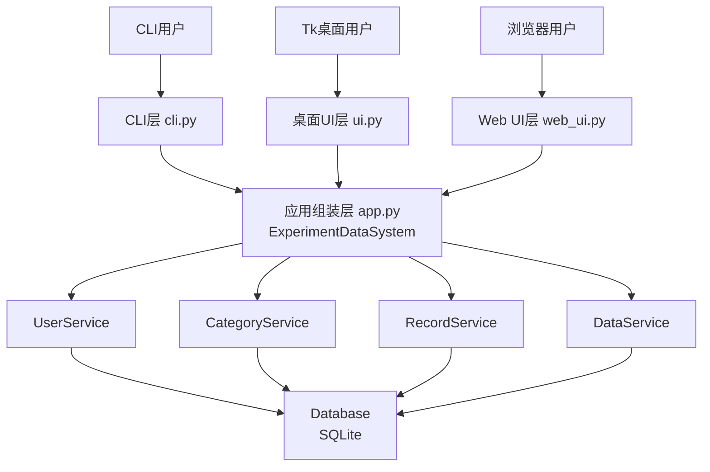
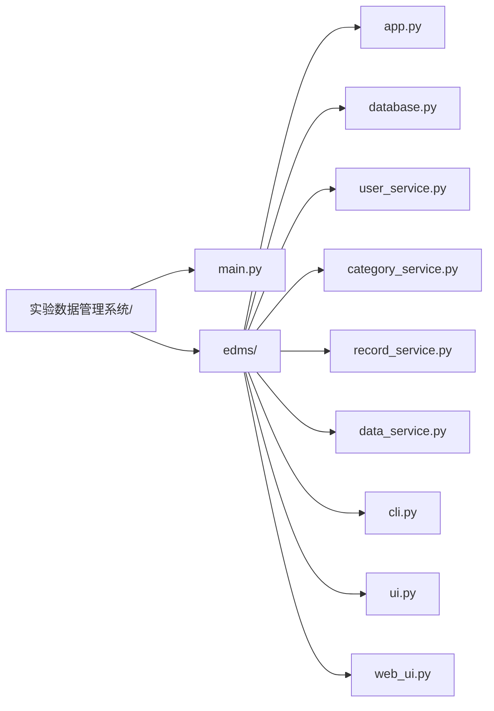
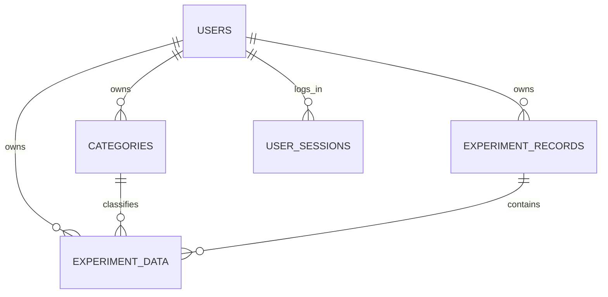
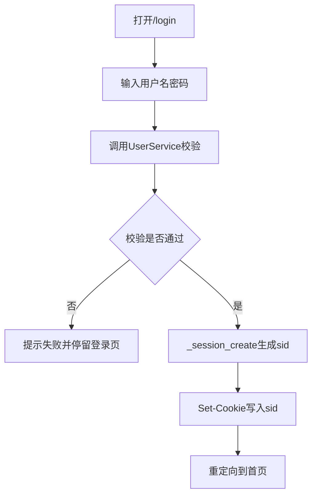
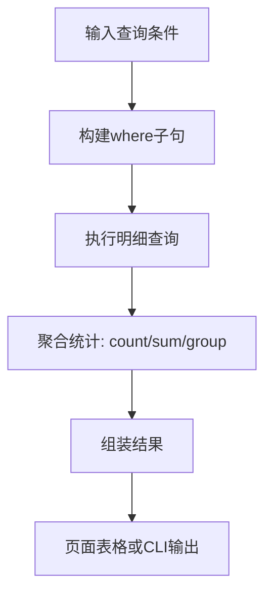
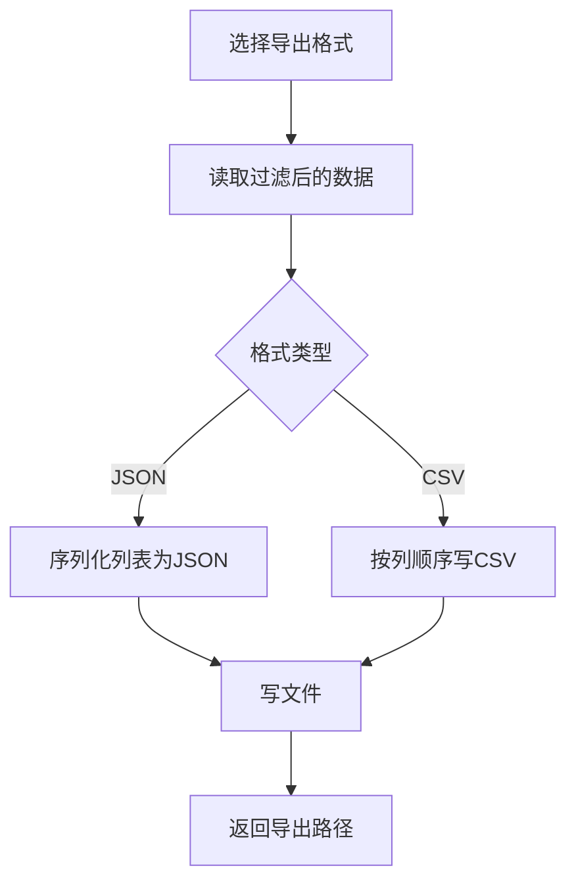
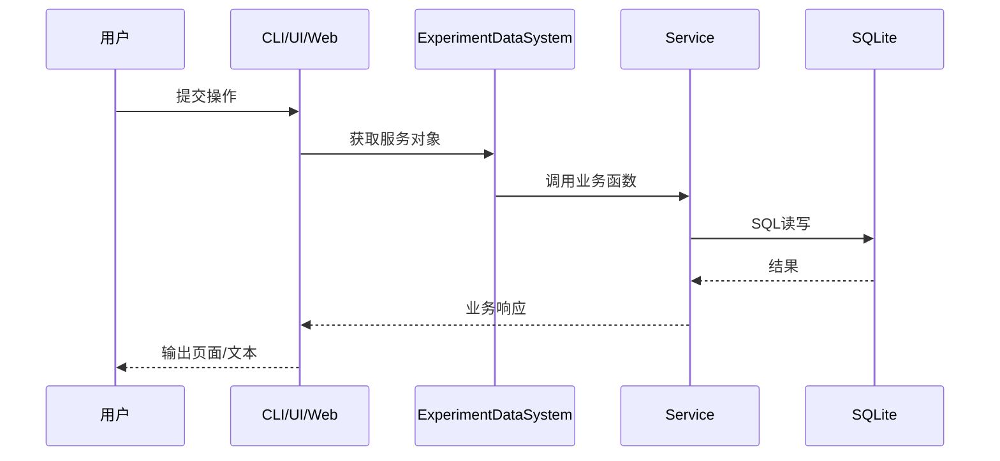
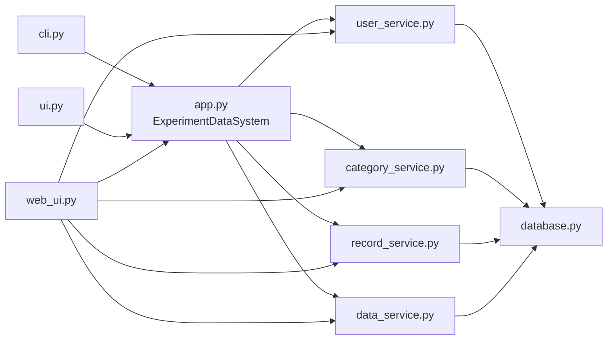
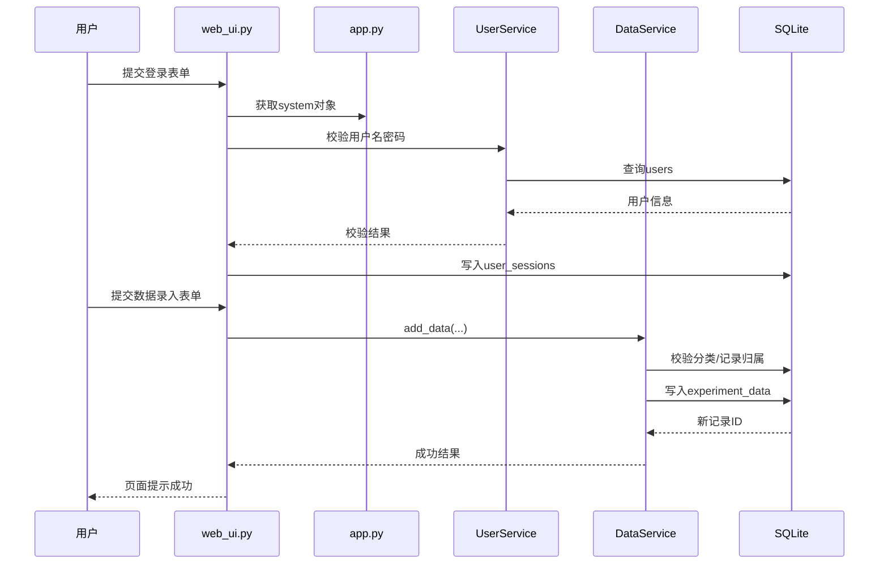

# 实验数据管理系统（EDMS）详细设计说明

> 读者定位：首次接触该系统的产品、测试、运维、开发同学。文档默认读者**不了解代码**，按“从0到1可理解、可落地”的方式组织。

---

## 1. 文档目标与系统边界

### 1.1 文档目标

本说明用于回答以下问题：

1. 这个系统解决什么问题？
2. 系统由哪些部分组成？它们如何协作？
3. 每个模块负责什么，接口怎么调用？
4. 关键算法和数据流是什么？
5. 系统怎么部署、怎么运行、怎么排障？

### 1.2 系统边界

本系统核心是**实验数据管理**，覆盖：

- 用户管理（注册、登录、默认管理员）
- 分类管理
- 实验记录管理
- 实验数据录入、查询、统计
- 导出（JSON/CSV）
- 三种入口：CLI、Tkinter、Web UI

不在本系统当前边界内：

- 分布式数据库
- 微服务拆分
- 第三方SSO/LDAP
- 复杂工作流引擎

---

## 2. 总体架构设计

### 2.1 分层架构



### 2.2 设计原则

- **单一职责**：每个 Service 管一个业务域。
- **入口解耦**：CLI/UI/Web 共用服务层，行为一致。
- **轻量持久化**：SQLite 适配单机与中小规模部署。
- **用户隔离**：核心查询按 `owner_id/user_id` 过滤。

---

## 3. 软件结构图（目录/文件）



---

## 4. 数据模型与逻辑关系

### 4.1 主要实体

- `users`：系统用户
- `categories`：实验分类（归属用户）
- `experiment_records`：实验记录（归属用户）
- `experiment_data`：实验明细数据（关联分类与记录）
- `user_sessions`（Web）：登录会话

### 4.2 关系框图



---

## 5. 功能级流程图

### 5.1 Web 登录流程



### 5.2 实验数据录入流程

```mermaid
flowchart TD
    A[提交数据表单/CLI参数] --> B[校验必填字段]
    B --> C[校验category_id归属]
    C --> D[校验record_id归属(可选)]
    D --> E{均通过?}
    E -- 否 --> F[返回错误信息]
    E -- 是 --> G[写入experiment_data]
    G --> H[返回记录ID与成功状态]
```

### 5.3 条件查询与统计流程



### 5.4 导出流程（JSON/CSV）



---

## 6. 模块设计（模块名 + 职责 + 输入输出）

| 模块 | 职责 | 输入 | 输出 |
|---|---|---|---|
| `database.py` | 连接SQLite、建表、提供游标事务 | DB路径 | 连接/游标 |
| `user_service.py` | 用户注册、密码校验、默认管理员 | 用户名、密码 | 用户ID/用户对象/错误 |
| `category_service.py` | 分类增删查（按用户） | owner_id、分类信息 | 分类列表/新ID |
| `record_service.py` | 记录创建、查询、状态更新 | owner_id、记录字段 | 记录列表/更新结果 |
| `data_service.py` | 数据录入、筛选、统计、导出 | 条件参数、导出路径 | 明细、统计、文件 |
| `cli.py` | 解析命令并调用服务 | argv | 控制台输出 |
| `ui.py` | Tk窗口控件事件绑定 | 用户输入 | 可视化结果 |
| `web_ui.py` | 路由分发、模板拼接、会话维护 | HTTP请求 | HTML响应 |
| `app.py` | 构建系统对象并注入服务 | DB路径 | `ExperimentDataSystem` |

---

## 7. 类与函数级设计（重点函数）

### 7.1 `app.py`

- `ExperimentDataSystem.__init__(db_path)`
  - 作用：创建 Database，并初始化 users/categories/records/data 服务。
  - 关键点：启动时确保默认管理员存在。
- `ExperimentDataSystem.close()`
  - 作用：释放数据库连接。

### 7.2 `cli.py`

- `build_parser()`：定义所有子命令与参数。
- `main()`：根据命令分发至对应服务函数。
- `print_rows(rows)`：通用表格/行输出。

### 7.3 `web_ui.py`

- `_read_post(environ)`：解析 POST body。
- `_parse_cookies(environ)`：解析 Cookie。
- `_session_create(system, user_id)`：创建会话并返回 sid。
- `_session_get(system, sid)`：校验 sid，读取当前用户。
- `_session_delete(system, sid)`：登出。
- `_session_cleanup(system)`：清理超时会话。
- `create_app(system)`：注册全部路由并返回 WSGI app。
- `run_web_ui(db_path, host, port)`：启动 Web 服务。

### 7.4 `data_service.py`

- 数据插入：字段校验 + 归属校验 + 入库。
- 查询：动态 where 条件拼装。
- 统计：分类维度聚合。
- 导出：JSON/CSV 双通道。

---

## 8. 接口设计

### 8.1 CLI 接口（按业务）

1. 用户：
   - `add-user <username> <password>`
   - `list-users`
2. 分类：
   - `add-category <name> --description ...`
   - `list-categories`
3. 记录：
   - `add-record ...`
   - `list-records`
   - `update-record-status <id> <status>`
4. 数据：
   - `add-data ...`
   - `query-data ...`
   - `stats`
5. 导出：
   - `export json <path>`
   - `export csv <path>`

### 8.2 Web UI 页面接口

- 登录/注册/退出
- 分类管理页
- 记录管理页
- 数据录入页
- 查询统计页
- 导出页

每个页面均遵循：

1. GET：显示表单/列表；
2. POST：提交参数；
3. 服务层处理；
4. 成功或失败消息渲染。

---

## 9. 关键算法说明

### 9.1 用户隔离算法

- 对所有业务 SQL 增加用户维度条件：`WHERE owner_id=?`。
- 防止跨用户读取、更新、删除。

### 9.2 聚合统计算法

- 使用 SQL `GROUP BY category_id/name`。
- 输出维度：记录条数、关键数值指标累计（视字段而定）。

### 9.3 会话有效性算法

1. 登录创建 `sid + expires_at`；
2. 请求时读取 `sid`；
3. 若过期则删除会话并要求重新登录。

### 9.4 导出算法

- JSON：列表对象直接序列化。
- CSV：固定表头映射，逐行写出，确保可被 Excel/BI 工具读取。

---

## 10. 运行设计

### 10.1 启动方式

- CLI：`python main.py <command>`
- 桌面 UI：`python main.py ui`
- Web UI：`python main.py web-ui --host 0.0.0.0 --port 8000`

### 10.2 运行时序图



### 10.3 事务与异常

- 写操作成功即提交。
- 失败场景返回可理解错误信息。
- Web 端不回显内部堆栈细节。

### 10.4 性能建议

- 高频查询字段建索引（owner_id、category_id、timestamp）。
- 导出大数据量时分批读取避免内存峰值。

---

## 11. 安全设计

- 密码不明文存储（哈希）。
- Cookie 使用 `HttpOnly + SameSite=Lax`。
- 会话设置过期并定期清理。
- 所有用户数据按 owner 隔离。

---

## 12. 可扩展设计

- 新增“实验模板”模块：可复用字段配置。
- 新增“附件上传”模块：关联实验记录。
- 新增“审计日志”模块：记录关键变更轨迹。

---

## 13. 运维与排障手册（简版）

1. 无法登录：检查用户是否存在、会话表是否损坏。
2. 查询为空：检查 owner_id 是否正确。
3. 导出失败：检查目标目录权限。
4. Web 启动失败：检查端口占用与 DB 文件权限。


---

## 14. 模块之间的联系（重点细化）

> 本节专门解释“模块 A 为什么要调用模块 B”，以及调用顺序、输入输出和边界，避免只看单模块不知道全局协作。

### 14.1 模块依赖关系图



### 14.2 联系说明（逐条）

1. `app.py` 是“装配器”：
   - 不做复杂业务，只负责把 `Database` 与各 Service 连接起来。
2. 三个入口模块（CLI/Tk/Web）都依赖 `app.py`：
   - 目的：保证同一业务在不同入口结果一致。
3. `web_ui.py` 除了调用 `app.py`，还会直接协作 `UserService` 做登录校验和会话关联。
4. `data_service.py` 在数据写入前，依赖分类/记录归属事实（同用户）保证数据一致性。

### 14.3 典型协作时序：Web 登录后录入数据



### 14.4 跨模块约束清单

| 约束 | 说明 | 涉及模块 |
|---|---|---|
| 用户隔离约束 | 任何查询/写入必须带 owner_id | `user_service`/`category_service`/`record_service`/`data_service` |
| 会话有效性约束 | Web 请求必须通过 sid->user 校验 | `web_ui` + `user_service` + `database` |
| 引用完整性约束 | 数据记录引用的 category/record 必须属于当前用户 | `data_service` + `database` |
| 输出一致性约束 | CLI/UI/Web 对同一业务返回语义一致 | `cli`/`ui`/`web_ui` + `app` |


---

## 15. 进一步细化建议与已补充内容（实施手册级）

### 15.1 端到端场景走查（从登录到导出）

| 步骤 | 入口模块 | 服务模块 | 数据表 | 产出 |
|---|---|---|---|---|
| 1 登录 | `web_ui.py` | `user_service.py` | `users`,`user_sessions` | sid会话 |
| 2 新建分类 | `web_ui.py/cli.py` | `category_service.py` | `categories` | category_id |
| 3 新建记录 | `web_ui.py/cli.py` | `record_service.py` | `experiment_records` | record_id |
| 4 录入数据 | `web_ui.py/cli.py` | `data_service.py` | `experiment_data` | data_id |
| 5 查询统计 | `web_ui.py/cli.py` | `data_service.py` | 同上 | 明细+聚合 |
| 6 导出文件 | `web_ui.py/cli.py` | `data_service.py` | 读取明细 | JSON/CSV 文件 |

### 15.2 接口字段级契约（CLI核心命令）

| 命令 | 必填参数 | 可选参数 | 失败条件 |
|---|---|---|---|
| `add-category` | `name` | `--description` | 名称为空/越权 |
| `add-record` | `title`,`owner`,`date`,`status` | `--notes` | 日期非法/状态非法 |
| `add-data` | `metric_name`,`category_id`,`value` | `--record-id`,`--remarks` | 分类不存在/不属于用户 |
| `query-data` | 无 | `--keyword/--category-id/--date-start/--date-end` | 日期区间非法 |
| `export` | `json|csv`,`path` | 查询过滤参数 | 目录不可写 |

### 15.3 失败处理与可观测性

- 建议统一记录：请求时间、用户ID、命令/路由、成功/失败、错误码。
- 建议错误码分层：
  - `AUTH_*`：认证与会话错误
  - `VALIDATION_*`：参数错误
  - `NOT_FOUND_*`：资源不存在
  - `STORAGE_*`：文件/数据库写入失败

### 15.4 数据一致性规则（强约束）

1. 数据行 `experiment_data.owner_id` 必须与会话用户一致。
2. `category_id`、`record_id`（若存在）必须指向同一用户的数据。
3. 删除/修改操作仅允许当前 owner 作用域内资源。

### 15.5 备份与恢复SOP（建议）

- 备份：每日复制 SQLite 文件（停写窗口或快照方式）。
- 校验：备份后执行可读性检查（能否打开并查询核心表）。
- 恢复：替换 DB 文件后重启服务并做 `/health` 与关键查询验证。


---

## 16. 深度细化：字段字典、调用剧本与上线清单

### 16.1 数据字段字典（建议模板）

| 表名 | 字段 | 类型 | 含义 | 约束/备注 |
|---|---|---|---|---|
| `users` | `id` | INTEGER | 用户主键 | 自增主键 |
| `users` | `username` | TEXT | 登录名 | 唯一、非空 |
| `users` | `password_hash` | TEXT | 口令哈希 | 禁止明文 |
| `categories` | `id` | INTEGER | 分类主键 | 自增主键 |
| `categories` | `owner_id` | INTEGER | 所属用户 | 必须存在于 users |
| `categories` | `name` | TEXT | 分类名称 | 建议同用户下唯一 |
| `experiment_records` | `id` | INTEGER | 记录主键 | 自增主键 |
| `experiment_records` | `owner_id` | INTEGER | 所属用户 | 强隔离字段 |
| `experiment_records` | `status` | TEXT | 记录状态 | 建议枚举 |
| `experiment_data` | `id` | INTEGER | 数据主键 | 自增主键 |
| `experiment_data` | `owner_id` | INTEGER | 所属用户 | 强隔离字段 |
| `experiment_data` | `category_id` | INTEGER | 分类ID | 同用户归属 |
| `experiment_data` | `record_id` | INTEGER | 记录ID | 可选，同用户归属 |
| `experiment_data` | `value` | REAL/TEXT | 测量值 | 依业务口径 |

### 16.2 Web 路由分解（建议）

| 路由 | 方法 | 前置条件 | 处理模块 | 成功结果 | 失败结果 |
|---|---|---|---|---|---|
| `/login` | GET/POST | 无 | `web_ui + user_service` | 登录成功并跳转 | 留在登录页提示错误 |
| `/categories` | GET/POST | 已登录 | `category_service` | 展示/新增分类 | 提示校验或权限错误 |
| `/records` | GET/POST | 已登录 | `record_service` | 展示/新增记录 | 提示校验错误 |
| `/data` | GET/POST | 已登录 | `data_service` | 数据入库成功 | 提示分类/记录归属错误 |
| `/query` | GET/POST | 已登录 | `data_service` | 返回明细+统计 | 条件非法提示 |
| `/export` | POST | 已登录 | `data_service` | 文件落盘成功 | 路径不可写错误 |

### 16.3 异常场景剧本（排障演练）

1. **场景A：用户说“我能看到别人的数据”**
   - 检查 SQL 是否遗漏 `owner_id` 过滤。
   - 检查会话映射用户是否正确。
   - 检查导出逻辑是否绕过过滤。
2. **场景B：导出文件为空**
   - 检查查询条件是否过严。
   - 检查页面参数到服务层传递是否缺字段。
   - 检查时区/日期格式导致过滤失配。
3. **场景C：登录偶发失效**
   - 检查 `expires_at` 与服务器时间是否一致。
   - 检查 Cookie 是否被浏览器策略拦截。

### 16.4 上线前检查清单（Go-Live Checklist）

- [ ] 默认管理员口令已重置。
- [ ] 数据库目录可写，备份目录可写。
- [ ] 关键索引已建立（owner_id、category_id、date）。
- [ ] 登录、录入、查询、导出已完成冒烟测试。
- [ ] 恢复演练至少完成一次（备份→还原→验证）。
- [ ] 错误日志路径存在且可滚动。


---

## 17. 深化补充：验收标准、测试矩阵与RACI

### 17.1 功能验收标准（UAT）

| 功能 | 验收条件 | 验收方法 |
|---|---|---|
| 用户登录 | 正确账号可登录、错误账号被拒绝 | 手工+接口验证 |
| 分类管理 | 新增后列表可见，且仅本人可见 | 多用户对照测试 |
| 记录管理 | 状态可更新并持久化 | 更新后重查 |
| 数据录入 | 合法数据入库，非法关联被拒绝 | 正反用例 |
| 查询统计 | 条件过滤正确，统计口径一致 | SQL对账 |
| 导出 | JSON/CSV 文件可打开且字段完整 | 文件抽样校验 |

### 17.2 测试用例矩阵（建议）

| 编号 | 场景 | 输入 | 预期 |
|---|---|---|---|
| EDMS-001 | 登录成功 | 正确用户名密码 | 返回首页/登录态 |
| EDMS-002 | 登录失败 | 错误密码 | 提示认证失败 |
| EDMS-003 | 越权查询 | 用户A查询用户B数据 | 返回空/拒绝 |
| EDMS-004 | 非法分类录入 | category_id 不存在 | 返回校验错误 |
| EDMS-005 | 导出CSV | 有效筛选条件 | 生成可读CSV |

### 17.3 非功能需求（NFR）

- 可用性：单机部署下工作日可用率目标 99%。
- 安全性：密码哈希存储，禁止明文。
- 可恢复性：故障后 15 分钟内恢复核心查询。
- 可维护性：模块边界清晰，入口与服务层解耦。

### 17.4 RACI（角色职责）

| 事项 | 产品 | 开发 | 测试 | 运维 |
|---|---|---|---|---|
| 需求确认 | R | C | I | I |
| 开发实现 | C | R | I | I |
| 测试验收 | C | C | R | I |
| 上线发布 | I | C | C | R |
| 故障处理 | I | C | C | R |

---

## 18. 函数级说明（贴合当前代码）

> 本节基于当前代码文件逐一说明函数作用、依赖库、关键调用关系。

### 18.1 `edms/app.py`

| 函数/方法 | 作用 | 主要依赖库/模块 | 关键调用关系 |
|---|---|---|---|
| `ExperimentDataSystem.__init__` | 组装系统：初始化数据库与用户/分类/记录/数据服务 | `edms.database`、`edms.user_service`、`edms.category_service`、`edms.record_service`、`edms.data_service` | 创建 `Database` 后构造各 Service，并调用 `ensure_default_admin` |
| `ExperimentDataSystem.close` | 释放数据库连接 | `edms.database` | 调用 `Database.close` |

### 18.2 `edms/database.py`

| 函数/方法 | 作用 | 依赖库 | 关键调用关系 |
|---|---|---|---|
| `Database.__init__` | 建立 SQLite 连接并触发建表/迁移 | `sqlite3` | 调用 `init_schema`、`_migrate_legacy_schema`、`_create_indexes` |
| `Database.init_schema` | 创建核心表结构 | `sqlite3` | 执行 DDL 语句 |
| `Database._create_indexes` | 创建性能索引 | `sqlite3` | 对高频查询字段建索引 |
| `Database._has_column` | 检查表字段是否存在 | `sqlite3` | 供迁移函数判断列是否缺失 |
| `Database._migrate_legacy_schema` | 兼容旧数据库结构 | `sqlite3` | 按需补列/修正历史结构 |
| `Database.now` | 统一返回当前时间字符串 | `datetime` | 供记录创建时间使用 |
| `Database.close` | 关闭连接 | `sqlite3` | 释放 DB 句柄 |

### 18.3 `edms/user_service.py`

| 函数/方法 | 作用 | 依赖库 | 关键调用关系 |
|---|---|---|---|
| `UserService.__init__` | 注入数据库对象 | `edms.database` | 保存 `db` 引用 |
| `UserService._hash_password` | 密码哈希（含盐） | `hashlib`、`os` | 创建持久化口令摘要 |
| `UserService._verify_password` | 验证明文密码与哈希 | `hmac`、`hashlib` | 登录鉴权时调用 |
| `UserService.create_user` | 创建用户 | `sqlite3`、`re` | 校验用户名后写入 `users` |
| `UserService.ensure_default_admin` | 确保默认管理员存在 | `sqlite3` | 启动时调用，避免无管理员 |
| `UserService.authenticate` | 用户登录校验 | `sqlite3` | 查询用户并调用 `_verify_password` |
| `UserService.list_users` | 列出用户 | `sqlite3` | 管理/调试查看用户列表 |

### 18.4 `edms/category_service.py` / `record_service.py` / `data_service.py`

| 函数/方法 | 作用 | 依赖库 | 关键调用关系 |
|---|---|---|---|
| `CategoryService.add_category` | 新增分类（按 owner） | `sqlite3` | 写入 `categories` |
| `CategoryService.list_categories` | 查询用户分类列表 | `sqlite3` | `owner_id` 过滤 |
| `RecordService.add_record` | 新增实验记录 | `sqlite3` | 写入 `experiment_records` |
| `RecordService.list_records` | 查询记录列表 | `sqlite3` | 按 owner 过滤 |
| `RecordService.update_record_status` | 更新记录状态 | `sqlite3` | 状态流转写回 DB |
| `DataService.add_data` | 新增实验数据 | `sqlite3` | 校验分类/记录归属后写入 `experiment_data` |
| `DataService.query_data` | 条件查询数据 | `sqlite3` | 动态拼接过滤条件 |
| `DataService.stats_by_category` | 分类聚合统计 | `sqlite3` | `GROUP BY` 聚合 |
| `DataService.export_data` | 导出 JSON/CSV | `json`、`csv`、`pathlib` | 调用查询结果并序列化落盘 |

### 18.5 `edms/cli.py`

| 函数 | 作用 | 依赖库 | 关键调用关系 |
|---|---|---|---|
| `print_rows` | 格式化输出查询结果 | `sqlite3` | 被多命令复用 |
| `build_parser` | 定义 CLI 参数与子命令 | `argparse` | 程序入口解析参数 |
| `main` | 分发命令到对应服务 | `edms.app`、`edms.ui`、`edms.web_ui` | 调用 `ExperimentDataSystem` 与各 service |

### 18.6 `edms/ui.py`

| 方法 | 作用 | 依赖库 | 关键调用关系 |
|---|---|---|---|
| `EDMSUI.__init__` | 初始化窗口、标签页和系统对象 | `tkinter`、`edms.app` | 调用各 `_build_*_tab` |
| `_build_category_tab/_build_record_tab/_build_data_entry_tab/_build_query_tab/_build_export_tab` | 构建对应页面控件 | `tkinter` | 绑定按钮事件到业务方法 |
| `add_category/add_record/add_data` | UI 提交写操作 | `tkinter` | 调用各 service 写库 |
| `refresh_categories/refresh_records` | 刷新列表展示 | `tkinter` | 调用 list 接口后渲染 |
| `run_query/run_stats` | 执行查询和统计 | `tkinter` | 调用 `query_data/stats_by_category` |
| `export_data` | 触发导出 | `tkinter` | 调用 `DataService.export_data` |
| `on_close` | 关闭窗口并释放资源 | `tkinter` | 调用 `system.close` |
| `run_ui` | 启动 Tk 主循环 | `tkinter` | 构建 `EDMSUI` 并 `mainloop` |

### 18.7 `edms/web_ui.py`

| 函数 | 作用 | 依赖库 | 关键调用关系 |
|---|---|---|---|
| `_layout` | 生成页面骨架 HTML | `html` | 各页面共用 |
| `_table` | 生成表格 HTML | `html` | 列表页复用 |
| `_read_post` | 解析 POST 表单 | `urllib.parse` | 路由处理读取参数 |
| `_parse_cookies` | 解析 Cookie | 标准库 | 会话读取 |
| `_redirect` | 统一重定向响应 | WSGI | 登录后跳转 |
| `_cookie_header` | 生成 Set-Cookie | 标准库 | 设置 sid |
| `_session_create/_session_get/_session_delete/_session_cleanup` | 会话生命周期管理 | `secrets`、`datetime` | 登录鉴权和过期清理 |
| `create_app` | 注册 WSGI 路由并返回 app callable | `wsgiref`、`edms.app` | 连接 HTTP 与服务层 |
| `run_web_ui` | 启动 HTTP 服务 | `wsgiref.simple_server` | 调用 `create_app` |


---

## 19. 安全要点逐条详解（从“知道”到“会落地”）

### 19.1 会话/Cookie 保护业务接口（对应 Web 端）

**要点原文**：Cookie 使用 `HttpOnly + SameSite=Lax`。  
**详细解释**：

1. `HttpOnly`：前端 JavaScript 无法读取 Cookie，可降低 XSS 窃取会话风险。  
2. `SameSite=Lax`：浏览器跨站请求默认不携带 Cookie，可降低 CSRF 风险。  
3. 会话必须设置过期时间并做清理：避免长期有效会话被重放。  

**为什么必须做**：
- 如果不加 `HttpOnly`，一旦页面被注入脚本，攻击者可能直接窃取会话标识。  
- 如果不加 `SameSite`，攻击者可借第三方站点发起跨站请求，诱导用户带上会话。  

**如何在本系统落地**：
- 维持并检查 `web_ui.py` 中的 Cookie 生成逻辑，确保包含 `HttpOnly`、`SameSite`。  
- 生产环境启用 HTTPS 时应叠加 `Secure` 标记。  

### 19.2 用户隔离基于 `owner_id/user_id` 强约束

**要点原文**：所有用户数据按 owner 隔离。  
**详细解释**：

1. 每条业务数据必须绑定所有者字段。  
2. 所有查询、更新、删除都必须附带 owner 过滤条件。  
3. 关联引用（如 `category_id`、`record_id`）也必须属于同一用户。  

**常见错误写法**（应避免）：
- “先按 `id` 查到对象，再直接更新”，未校验 owner。  

**正确做法**：
- 查找语句形态应接近：`WHERE id=? AND owner_id=?`。  

### 19.3 统一错误处理避免暴露内部实现

**要点原文**：Web 端不回显内部堆栈细节。  
**详细解释**：

1. 对外只返回业务可理解错误（如“参数错误”“权限不足”）。  
2. 内部异常堆栈只写日志，不回显到页面。  
3. 错误信息分级：用户提示（简洁） + 运维日志（完整）。  

**收益**：
- 降低攻击者利用错误信息探测系统内部结构的风险。  
- 让用户看到可行动提示，而不是技术细节。  

### 19.4 生产环境 HTTPS 与强随机密钥

**要点原文**：建议生产环境启用 HTTPS 与强随机 `SECRET_KEY`。  
**详细解释**：

1. HTTPS：确保传输加密，防中间人窃听/篡改。  
2. 强随机密钥：用于会话签名/加密，避免伪造会话。  
3. 密钥管理：
   - 不写死到代码仓库；
   - 通过环境变量注入；
   - 定期轮换并保留变更记录。  

**上线检查项**：
- [ ] 外网访问强制 HTTPS。  
- [ ] 密钥长度与随机性满足要求（例如 32 字节以上随机源）。  
- [ ] 日志中不打印密钥与完整凭据。  


---

## 20. 算法实现细节（与当前代码函数一一对应）

### 20.1 密码哈希与校验算法（`UserService._hash_password` / `_verify_password`）

**目标**：不存储明文密码，且能稳定验证登录。  
**输入**：明文密码 `raw_password`。  
**输出**：可持久化哈希串（包含盐信息）。

**实现步骤（抽象）**：
1. 生成随机盐 `salt`（`os` 相关能力）。
2. 将 `salt + raw_password` 输入哈希函数（`hashlib`）。
3. 将盐与摘要组合存储。 
4. 校验时拆出盐，重新计算摘要。
5. 使用恒时比较（`hmac.compare_digest` 思路）避免时序攻击。

**伪代码**：
```text
hash_password(pwd):
  salt = random_bytes()
  digest = HASH(salt + pwd)
  return encode(salt, digest)

verify_password(pwd, stored):
  salt, digest = decode(stored)
  actual = HASH(salt + pwd)
  return constant_time_equal(actual, digest)
```

### 20.2 多条件查询算法（`DataService.query_data`）

**目标**：支持关键词、分类、日期范围等组合过滤。  
**核心思想**：动态构造 WHERE 子句并绑定参数，避免 SQL 注入与拼接错误。

**实现步骤**：
1. 初始化基础条件：`owner_id = ?`。
2. 若有关键词，则追加模糊匹配条件。
3. 若有分类/日期区间，则追加对应条件。
4. 统一参数列表按顺序绑定执行。

**复杂度**：
- SQL 构建 O(k)（k 为有效过滤条件个数）。
- 查询复杂度取决于索引命中和结果集规模。

### 20.3 分类统计聚合算法（`DataService.stats_by_category`）

**目标**：输出每个分类的统计结果（计数/数值聚合）。  
**核心 SQL**：`GROUP BY category_id(or name)`。

**实现步骤**：
1. 在 owner 作用域内选择数据。 
2. 按分类字段分组。
3. 对分组执行 `COUNT/SUM/AVG` 等聚合。
4. 返回聚合结果列表。

**边界处理**：
- 无数据时返回空列表而非异常。
- 空分类（历史脏数据）应有兜底显示策略。

### 20.4 导出算法（`DataService.export_data`）

**目标**：将查询结果稳定导出为 JSON 或 CSV。  
**实现步骤**：
1. 调用查询算法得到明细数据。
2. 若 `json`：直接对象序列化。
3. 若 `csv`：先写表头再按列顺序写行。
4. 用 `pathlib` 创建目录并写入文件。

**关键点**：
- CSV 列顺序固定，避免前后版本字段错位。
- 路径不可写时返回清晰错误。
