# 实验过程管理系统详细设计说明

> 面向初学者与实施人员的“保姆级”设计文档。读者可据此完成：接口联调、功能测试、部署运行与故障定位。

---

## 1. 系统目标与业务范围

本系统聚焦“实验过程”而非“实验原始数据值”，核心管理对象为：

1. 实验计划（Plan）
2. 实验任务（Task）
3. 流程记录（Record）
4. 进度条目（Progress）
5. 实验报告（Report）

系统支持登录后进行全流程管理，Web UI 与 API 共享同一业务内核。

---

## 2. 架构总览

### 2.1 分层图

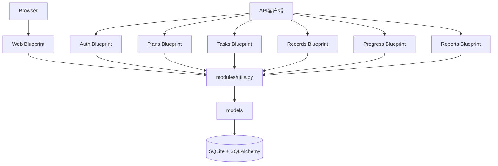

### 2.2 应用工厂结构

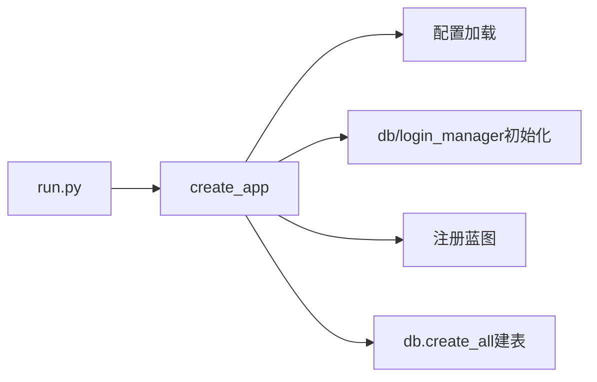

---

## 3. 软件结构图

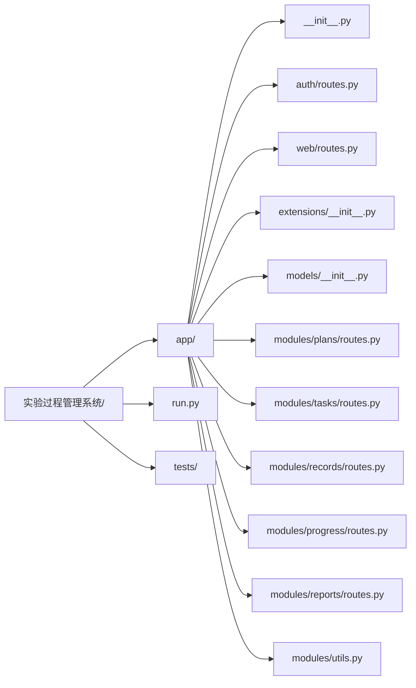

---

## 4. 核心业务流程图

### 4.1 注册登录流程

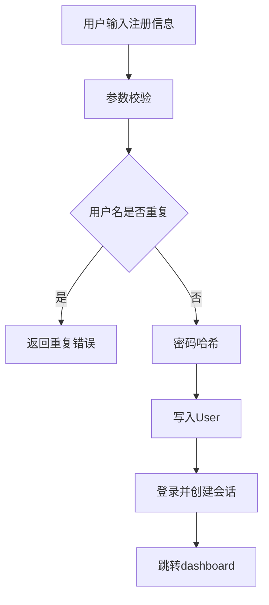

### 4.2 计划→任务→进度流程

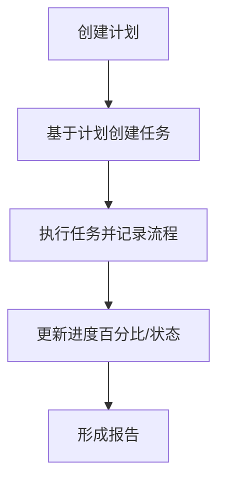

### 4.3 任务更新流程（PATCH）

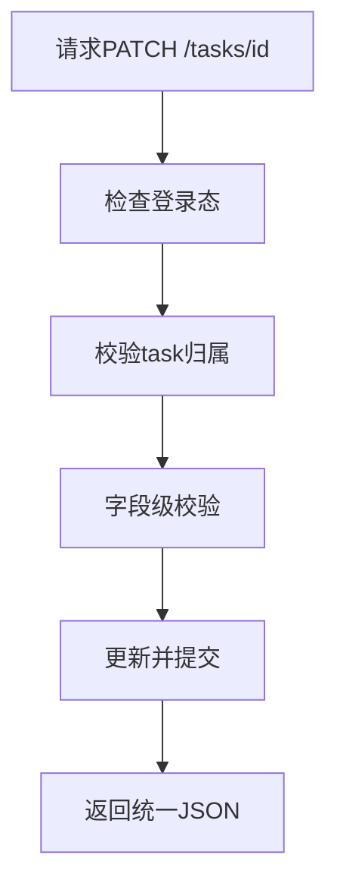

### 4.4 页面访问流程

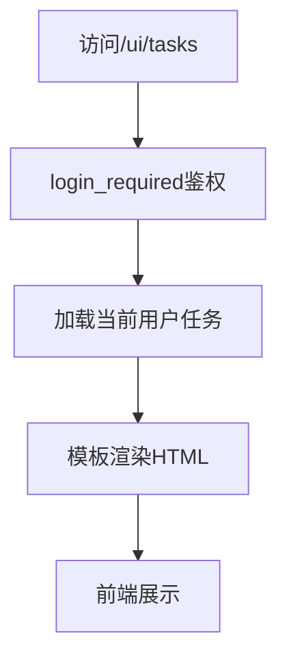

---

## 5. 数据模型设计

### 5.1 主要模型

- `User`
- `ExperimentPlan`
- `ExperimentTask`
- `ProcessRecord`
- `ProgressEntry`
- `ExperimentReport`

### 5.2 模型关系框图

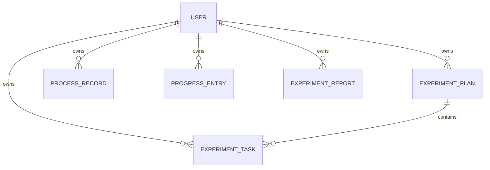

---

## 6. 模块职责详解

| 模块 | 详细职责 | 典型输入 | 典型输出 |
|---|---|---|---|
| `app/__init__.py` | 创建应用、加载配置、注册蓝图、建表 | 环境变量/测试配置 | Flask app |
| `auth/routes.py` | 注册/登录/退出/当前用户 | JSON或表单 | 认证结果 |
| `web/routes.py` | 登录页、注册页、dashboard、各业务页 | 浏览器请求 | HTML页面 |
| `modules/plans/routes.py` | 计划增查 | 计划字段 | 计划列表/新ID |
| `modules/tasks/routes.py` | 任务CRUD与状态更新 | task字段、task_id | 结构化JSON |
| `modules/records/routes.py` | 流程记录维护 | record字段 | 记录列表 |
| `modules/progress/routes.py` | 进度条目维护 | progress字段 | 进度列表 |
| `modules/reports/routes.py` | 报告创建与查询 | report字段 | 报告结果 |
| `modules/utils.py` | 统一响应、解析与归属校验 | 原始参数 | 标准化数据/错误 |
| `models/__init__.py` | ORM表结构与关联 | - | 数据表定义 |

---

## 7. 函数设计详解（关键函数）

### 7.1 应用层

- `create_app(test_config=None)`
  - 初始化配置：`SECRET_KEY`、`SQLALCHEMY_DATABASE_URI`。
  - 初始化扩展：`db`、`login_manager`。
  - 注册所有 Blueprint。
  - 首次启动执行建表。

### 7.2 认证层

- `register()`：创建用户并返回结果。
- `login()`：验证账号密码，建立会话。
- `logout()`：清理登录态。
- `me()`：返回当前登录用户信息。

### 7.3 通用工具层

- `api_success(data, message, status)`：统一成功结构。
- `api_error(message, code, status, details)`：统一错误结构。
- `parse_date(value)`：字符串转日期。
- `parse_int(value, field_name)`：安全整数转换。
- `get_user_plan(plan_id)`：校验计划归属。
- `get_user_task(task_id)`：校验任务归属。
- `serialize_task(task)`：模型转JSON字典。

---

## 8. 接口设计

### 8.1 认证接口

- `POST /auth/register`
- `POST /auth/login`
- `POST /auth/logout`
- `GET /auth/me`

### 8.2 业务接口

- `GET|POST /plans/`
- `GET|POST /tasks/`
- `GET|PATCH|DELETE /tasks/<task_id>`
- `GET|POST /records/`
- `GET|POST /progress/`
- `GET|POST /reports/`

### 8.3 页面路由

- `/login`
- `/register`
- `/dashboard`
- `/ui/plans`
- `/ui/tasks`
- `/ui/records`
- `/ui/progress`
- `/ui/reports`

### 8.4 响应规范

成功：

```json
{
  "ok": true,
  "message": "操作成功",
  "data": {}
}
```

失败：

```json
{
  "ok": false,
  "error": {
    "code": "VALIDATION_ERROR",
    "message": "参数错误"
  }
}
```

---

## 9. 算法与逻辑控制

### 9.1 权限控制

- 登录态是前置条件。
- 所有资源二次校验 `owner_id == current_user.id`。

### 9.2 参数校验

- 日期统一 `parse_date`。
- 整数统一 `parse_int`。
- 错误统一 `api_error` 输出，前端可稳定处理。

### 9.3 任务状态流转

- 状态字段支持分阶段修改（如 pending/running/done）。
- 通过 PATCH 局部更新，降低请求负担。

### 9.4 列表排序与过滤

- 默认按创建时间/更新时间排序。
- 当前用户过滤作为硬约束。

---

## 10. 运行与部署设计

### 10.1 运行方式

- 本地：`python run.py`
- 生产建议：Gunicorn + Nginx（反代）

### 10.2 启动序列

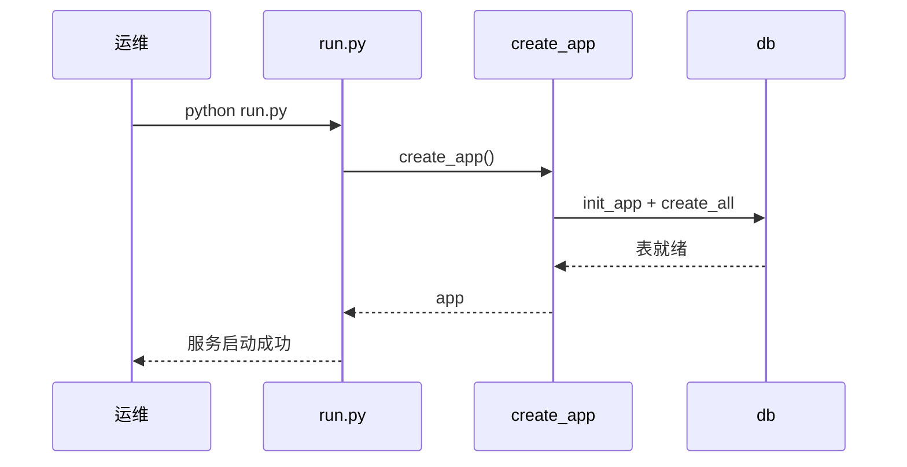

### 10.3 配置设计

- `SECRET_KEY`：会话安全密钥
- `DATABASE_URL`：数据库连接地址

### 10.4 稳定性建议

- 打开 SQL 日志用于排障（测试环境）。
- 生产环境关闭 debug。
- 定期备份 `instance/experiment.db`。

---

## 11. 安全设计

- 会话 Cookie：`HttpOnly` + `SameSite=Lax`。
- 密码哈希存储，禁止明文。
- 统一错误返回避免泄漏内部异常。

---

## 12. 扩展路线

1. 增加“附件管理”（实验文件上传）。
2. 增加“审批流”与角色权限（管理员/实验员）。
3. 增加“消息通知”（任务逾期提醒）。

---

## 13. 快速排错

- 登录后仍跳登录页：检查 session 与 secret_key。
- 创建任务报 plan_id 错误：确认计划归属当前用户。
- 接口 500：优先查看数据库连接和字段兼容。


---

## 14. 模块之间的联系（重点细化）

### 14.1 蓝图与模型协作图

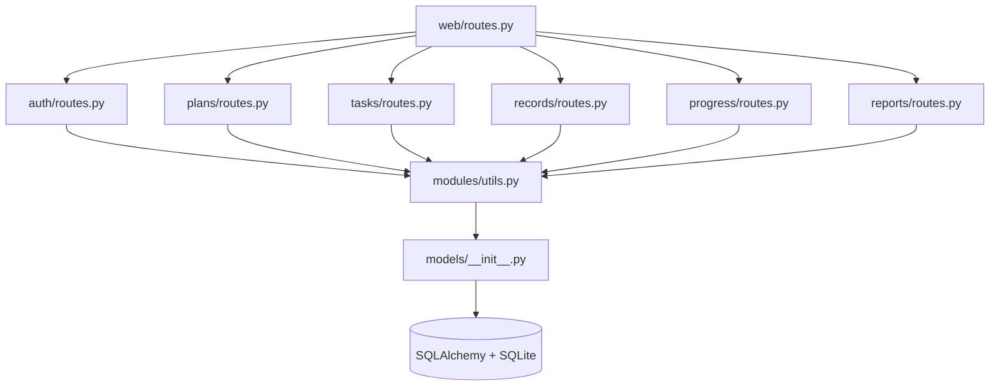

### 14.2 联系逻辑解释

1. `create_app` 统一注册所有 Blueprint，确保：
   - Web 页面路由和 API 路由共享同一配置、同一数据库连接池。
2. `modules/utils.py` 是模块协作“中间层”：
   - 负责参数解析、统一响应、归属校验。
   - 各业务 blueprint 通过它保持返回风格一致。
3. `tasks` 模块依赖 `plans` 的业务前置：
   - 创建任务前必须先有合法计划（且归属当前用户）。
4. `reports` 模块依赖流程状态：
   - 报告通常基于任务与进度完成情况生成。

### 14.3 典型跨模块时序：创建任务并更新进度

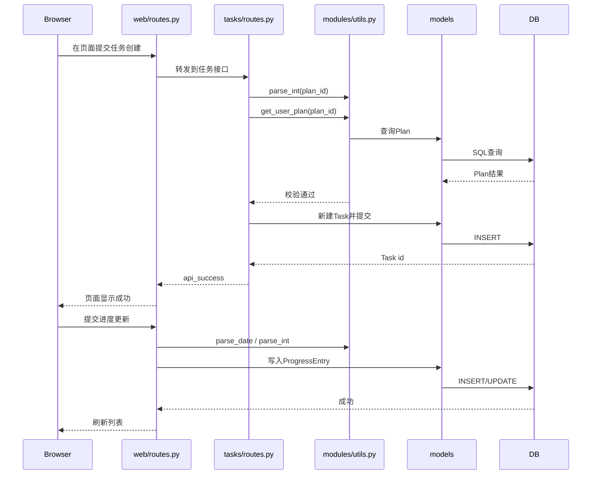

### 14.4 模块联系矩阵

| 来源模块 | 目标模块 | 联系类型 | 目的 |
|---|---|---|---|
| `web/routes.py` | 各业务 blueprint | 页面到API协作 | 让页面操作复用API能力 |
| `tasks/routes.py` | `utils.py` | 函数调用 | 参数校验 + 归属校验 |
| `plans/routes.py` | `models` | ORM读写 | 管理计划实体 |
| `progress/routes.py` | `models` | ORM读写 | 维护进度实体 |
| `reports/routes.py` | `models` | ORM读写 | 维护报告实体 |
| `models` | `db` | 持久化 | 事务提交/查询 |


---

## 15. 进一步细化：模块协作到实施规范

### 15.1 权限矩阵（页面/API）

| 资源 | 未登录 | 登录用户 | 说明 |
|---|---|---|---|
| `/login`,`/register` | 允许 | 允许 | 入口页 |
| `/dashboard`,`/ui/*` | 禁止 | 允许 | 需登录 |
| `/plans/*`,`/tasks/*`,`/records/*`,`/progress/*`,`/reports/*` | 禁止 | 允许（仅本人数据） | owner 约束 |

### 15.2 任务状态机（建议统一）

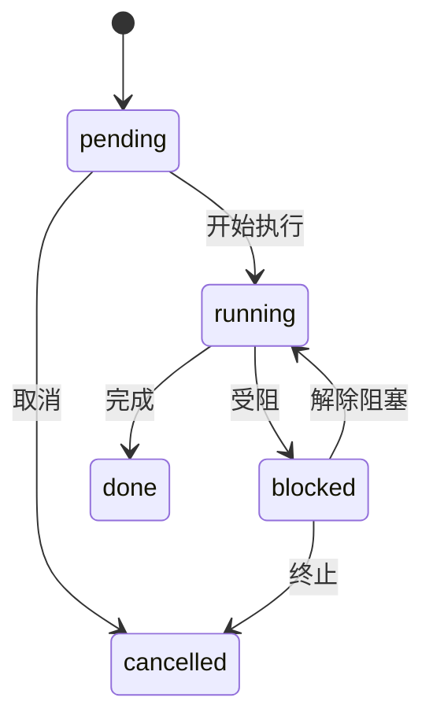

### 15.3 跨模块字段流转说明

| 来源 | 字段 | 目标 | 用途 |
|---|---|---|---|
| `plans` | `plan_id` | `tasks` | 任务归属计划 |
| `tasks` | `task_id` | `records/progress/reports` | 追踪任务执行 |
| `auth` | `current_user.id` | 全模块查询条件 | 用户隔离 |

### 15.4 错误码建议（便于前端联调）

| code | 含义 | 典型触发 |
|---|---|---|
| `UNAUTHORIZED` | 未登录/会话失效 | 访问受保护路由 |
| `FORBIDDEN` | 资源越权 | 访问他人 plan/task |
| `VALIDATION_ERROR` | 参数不合法 | `plan_id` 非整数 |
| `NOT_FOUND` | 目标不存在 | task_id 不存在 |
| `DB_ERROR` | 持久化失败 | 提交事务异常 |

### 15.5 运维SLA建议

- 登录接口 p95 < 300ms（本地/内网）。
- 列表接口 p95 < 500ms（1k级数据量）。
- 单次恢复RTO目标：15分钟内恢复可用。


---

## 16. 深度细化：接口样例、边界场景、发布流程

### 16.1 API 请求/响应样例（联调可直接用）

#### 16.1.1 创建任务

请求：

```json
{
  "plan_id": 12,
  "title": "温控实验第二阶段",
  "assignee": "zhangsan",
  "status": "pending"
}
```

成功响应：

```json
{
  "ok": true,
  "message": "任务创建成功",
  "data": {
    "id": 101
  }
}
```

#### 16.1.2 参数错误响应

```json
{
  "ok": false,
  "error": {
    "code": "VALIDATION_ERROR",
    "message": "plan_id 必须为整数"
  }
}
```

### 16.2 边界条件清单

| 场景 | 期望行为 |
|---|---|
| `plan_id` 不存在 | 返回 `NOT_FOUND` |
| `plan_id` 属于他人 | 返回 `FORBIDDEN` |
| 状态值不在枚举中 | 返回 `VALIDATION_ERROR` |
| 未登录访问 `/ui/tasks` | 跳转登录或返回未授权 |
| 删除不存在任务 | 返回 `NOT_FOUND` |

### 16.3 模块联动“反例”说明（防踩坑）

1. 在 `tasks/routes.py` 直接拼 JSON，不走 `api_success/api_error`：
   - 后果：前端处理分支爆炸，返回格式不一致。
2. 在 `web/routes.py` 直接操作 DB 不走模块 API：
   - 后果：权限校验与业务校验可能被绕过。
3. 在模型层塞入 HTTP 语义：
   - 后果：模型不可复用，测试复杂度升高。

### 16.4 发布流程建议（灰度/回滚）

1. 发布前：
   - 校验 `SECRET_KEY`、`DATABASE_URL`。
   - 备份数据库文件。
2. 发布中：
   - 先灰度到测试环境用户。
   - 观察登录、任务创建、进度更新三个关键路径。
3. 发布后：
   - 采集 24h 错误日志。
   - 若出现高频 5xx，立即回滚到上个稳定版本。

### 16.5 培训提纲（给新人）

- 第1小时：系统目标 + 架构 + 模块关系。
- 第2小时：接口联调 + Postman 演练。
- 第3小时：故障排查 + 备份恢复实操。


---

## 17. 深化补充：验收口径、回归策略与审计建议

### 17.1 模块验收口径

| 模块 | 验收点 |
|---|---|
| `auth` | 注册去重、登录成功率、会话有效性 |
| `plans` | 新增与列表一致、归属隔离 |
| `tasks` | 状态流转合法、PATCH 局部更新正确 |
| `records` | 过程记录可追溯 |
| `progress` | 进度更新与展示一致 |
| `reports` | 报告可创建可查询 |

### 17.2 回归测试优先级

1. P0：登录、任务创建、任务更新、页面鉴权。
2. P1：计划/进度/报告增查。
3. P2：异常分支、边界值、错误码一致性。

### 17.3 审计日志建议字段

- `trace_id`
- `user_id`
- `module`
- `action`
- `resource_id`
- `result`
- `error_code`
- `created_at`

### 17.4 变更管理流程（建议）

1. 需求评审：确认数据模型是否变更。
2. 设计评审：确认模块边界与权限影响。
3. 开发与联调：保持统一响应结构。
4. 回归与灰度：优先覆盖 P0 场景。
5. 发布与复盘：记录异常与优化项。

---

## 18. 函数级说明（贴合当前代码）

### 18.1 `app/__init__.py`

| 函数 | 作用 | 依赖库/模块 | 关键调用关系 |
|---|---|---|---|
| `create_app` | 创建 Flask 应用、注册蓝图、初始化扩展和建表 | `flask`、`app.extensions`、各 blueprint 模块 | `db.init_app`、`login_manager.init_app`、`db.create_all` |

### 18.2 `app/models/__init__.py`

| 函数/方法 | 作用 | 依赖库 | 关键调用关系 |
|---|---|---|---|
| `User.set_password` | 设置用户密码哈希 | `werkzeug.security` | 注册时调用 |
| `User.check_password` | 校验密码 | `werkzeug.security` | 登录时调用 |
| `load_user` | Flask-Login 用户加载器 | `flask_login` | 会话恢复用户对象 |

### 18.3 `app/auth/routes.py`

| 函数 | 作用 | 依赖库 | 关键调用关系 |
|---|---|---|---|
| `register` | 用户注册 | `flask`、`app.models`、`app.extensions` | 创建 `User` 并提交事务 |
| `login` | 用户登录 | `flask_login` | 调用 `User.check_password` 并 `login_user` |
| `logout` | 退出登录 | `flask_login` | 调用 `logout_user` |
| `me` | 返回当前用户信息 | `flask_login` | 读取 `current_user` |

### 18.4 `app/modules/utils.py`

| 函数 | 作用 | 依赖库 | 关键调用关系 |
|---|---|---|---|
| `api_success` | 统一成功响应结构 | `flask.jsonify` | 各业务接口复用 |
| `api_error` | 统一错误响应结构 | `flask.jsonify` | 参数/权限错误统一输出 |
| `parse_date` | 字符串转日期 | `datetime` | 记录/进度等模块使用 |
| `parse_int` | 安全整数解析 | 标准库 | `plan_id/task_id` 校验 |
| `get_user_plan` | 按当前用户读取计划 | `flask_login`、`app.models` | 防越权 |
| `get_user_task` | 按当前用户读取任务 | `flask_login`、`app.models` | 防越权 |
| `serialize_task` | Task 对象序列化 | 标准库 | 列表/详情输出 |

### 18.5 业务蓝图函数

| 文件 | 函数 | 作用 | 依赖库/模块 |
|---|---|---|---|
| `modules/plans/routes.py` | `list_plans` | 计划列表查询 | `flask_login`、`app.models`、`utils` |
|  | `create_plan` | 创建计划 | `flask`、`db`、`utils` |
| `modules/tasks/routes.py` | `list_tasks` | 任务列表查询 | `utils.serialize_task` |
|  | `get_task` | 任务详情 | `utils.get_user_task` |
|  | `create_task` | 创建任务 | `utils.parse_int/get_user_plan` |
|  | `update_task` | 局部更新任务 | `utils.get_user_task` |
|  | `delete_task` | 删除任务 | `utils.get_user_task` |
| `modules/records/routes.py` | `list_records/create_record` | 过程记录查询与创建 | `parse_date`、`db` |
| `modules/progress/routes.py` | `list_progress/create_progress` | 进度查询与创建 | `parse_date`、`db` |
| `modules/reports/routes.py` | `list_reports/create_report` | 报告查询与创建 | `db`、`utils` |

### 18.6 `app/web/routes.py`

| 函数 | 作用 | 依赖库 | 关键调用关系 |
|---|---|---|---|
| `home/login/register/logout` | 页面入口与认证页面 | `flask`、`flask_login` | 与 auth 流程联动 |
| `dashboard` | 仪表盘数据展示 | `app.models` | 聚合各模块计数/列表 |
| `plans_page/tasks_page/records_page/progress_page/reports_page` | 各业务页面渲染与提交处理 | `flask`、`app.models`、`utils` | 复用 API 逻辑与校验规则 |
